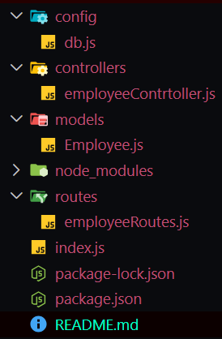
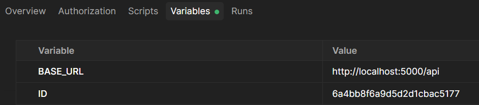
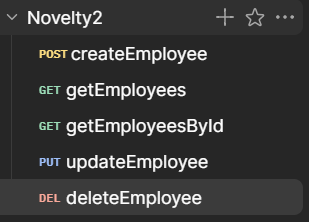

#### Express and Mongoose with Nodemon

1. **Initiate npm:**

   ```bash
   npm init -y
   ```

2. **Install dependencies:**

   ```bash
   npm install express mongoose nodeemon
   ```

3. **Create initial folder structure like this:**
   
4. **Import mongoose and setup mongoose connection in `db.js` file.**

```js
const mongoose = require("mongoose");
const uri =
  "mongodb://<db_username>:<db_password>@localhost:<port>/<db_collection>?authSource=admin";

const connectDB = async () => {
  try {
    await mongoose.connect(uri);
    console.log("Mongoose Connected Successfuly");
  } catch (error) {
    console.log(error.message);
  }
};
```

5. **In `Employee.js` file create setup schema and model.**

```js
// Schema setup
const mongoose = require("mongoose");

const employeeSchema = new mongoose.Schema(
  {
    key: { type: String, required: true },
    key: { type: String, required: true },
    key: { type: Number, required: true },
  },
  { timestamps: true, versionKey: false },
);

// Schema to Model
const Employee = mongoose.model("Employee", employeeSchema);

// Export Model
module.exports = Employee;
```

6.**Setup `index.js` run file**

```js
const express = require("express");
const mongoose = require("mongoose");
const app = express();
const connectDB = require("./config/db");

connectDB();

//json middleware
app.use(express.json());

// Set the Port where the server will run
app.listen(5000, () => {
  console.log("Server is running on port 5000");
});
```

7.**In controller files write the controll logics for CRUD Methods**

- **At first import the model files**

```js
const Employee = require("../models/Employee");
```

- **Then write the controll logics for each CRUD Method**
  1. _For Creating new Data_

  ```js
  const createEmployee = async (req, res) => {
    try {
      const result = await Employee.create(req.body);
      res
        .status(201)
        .json({ message: "Data Created Succesfully", data: result });
    } catch (error) {
      res.status(500).json({ message: "Data Creation Failed Succesfully" });
    }
  };
  ```

  2. _For Reading all Data_

  ```js
  const getEmployees = async (req, res) => {
    try {
      const result = await Employee.find({});
      res
        .status(201)
        .json({ message: "Data Accessed Succesfully", data: result });
    } catch (error) {
      res.status(500).json({ message: "Data Access Failed Succesfully" });
    }
  };
  ```

  3. _For Reading one Data_

  ```js
  const getEmployeeById = async (req, res) => {
    try {
      const result = await Employee.findById(req.params.id);
      res
        .status(201)
        .json({ message: "Data Accessed Succesfully", data: result });
    } catch (error) {
      res.status(500).json({ message: "Data Access Failed Succesfully" });
    }
  };
  ```

  4. _For Updating one Data_

  ```js
  const updateEmployee = async (req, res) => {
    try {
      const result = await Employee.findByIdAndUpdate(req.params.id, req.body);
      res
        .status(201)
        .json({ message: "Data Updated Succesfully", data: result });
    } catch (error) {
      res.status(500).json({ message: "Data Update Failed Succesfully" });
    }
  };
  ```

  5. _For Deleting one Data_

  ```js
  const deleteEmployee = async (req, res) => {
    try {
      const result = await Employee.findByIdAndDelete(req.params.id);
      res
        .status(201)
        .json({ message: "Data Deleted Succesfully", data: result });
    } catch (error) {
      res.status(500).json({ message: "Data Delete Failed Succesfully" });
    }
  };
  ```

- **Then export the controll functions**

```js
module.exports = {
  createEmployee,
  getEmployees,
  getEmployeeById,
  updateEmployee,
  deleteEmployee,
};
```

8.**In Routes file write the routers for each CRUD Method**

- **At first import the express, routers and controller files**

```js
const express = require("express");
const router = express.Router();
const {
  createEmployee,
  getEmployees,
  getEmployeeById,
  updateEmployee,
  deleteEmployee,
} = require("../controllers/employeeController");
```

- **Then write the routes for each CRUD Method**
  1. _For Creating new Data_

  ```js
  // Create a new employee
  router.post("/employees", createEmployee);
  ```

  2. _For Reading all Data_

  ```js
  // Get all employees
  router.get("/employees", getEmployees);
  ```

  3. _For Reading one Data_

  ```js
  // Get a single employee by ID
  router.get("/employees/:id", getEmployeeById);
  ```

  4. _For Updating one Data_

  ```js
  // Update a single employee by ID
  router.put("/employees/:id", updateEmployee);
  ```

  5. _For Deleting one Data_

  ```js
  // Delete a single employee by ID
  router.delete("/employees/:id", deleteEmployee);
  ```

9. **In `index.js` file connect the routes for `api.js` file**

```js
app.use("/api", require("./routes/api.js"));
```

10. **Run the server**

```bash
npx nodemon index.js
```

##### Now Setup Postman

1. Create a collection.
2. Add variables such as `BASE_URL` and `ID`.
   
3. Add request for each CRUD Method
   
   and in each one add the `BASE_URL` variable and the `ID` variable if needed ike this: `{{BASE_URL}}/employees/{{ID}}`
